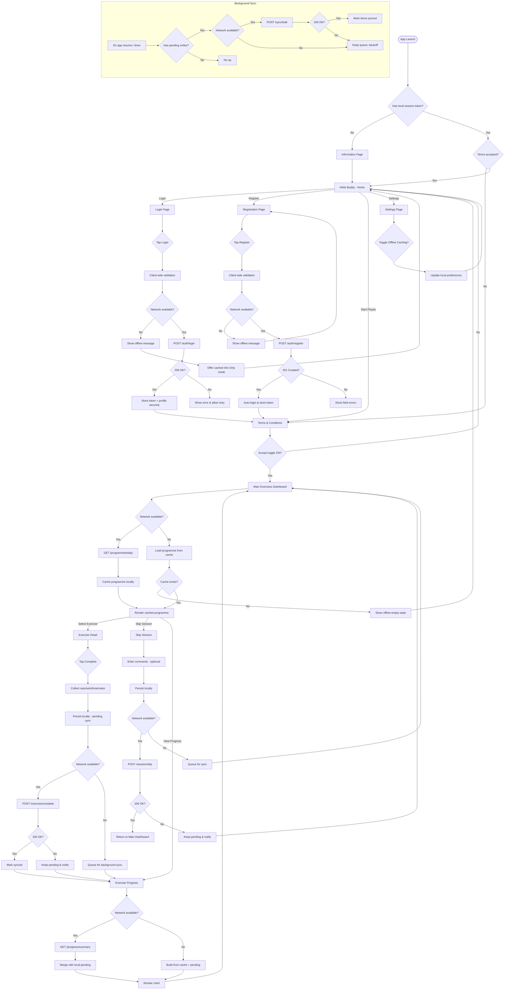

---

# End-to-End Workflow (Narrative)

1) **Launch & Session Gate** → If no token, user sees **Information** then **Home**. If token exists but Terms not accepted, route to **Terms**.
2) **Home** → Entry to **Login**, **Registration**, **Start Physio** (Terms), **Settings**.
3) **Auth** → Validate → POST login/register → store token → **Terms** if required.
4) **Terms** → Toggle **Accept** → proceed to **Main Dashboard**.
5) **Dashboard** → Fetch/Cache programme (or use cached offline) → open **Exercise Detail**, **Progress**, or **Skip**.
6) **Exercise Detail** → User completes parameters → Local persist → POST now or queue if offline.
7) **Progress** → Merge server data with pending local items → render chart.
8) **Skip** → Local persist → POST now or queue.
9) **Background Sync** → Flush pending writes on resume/timer with backoff.