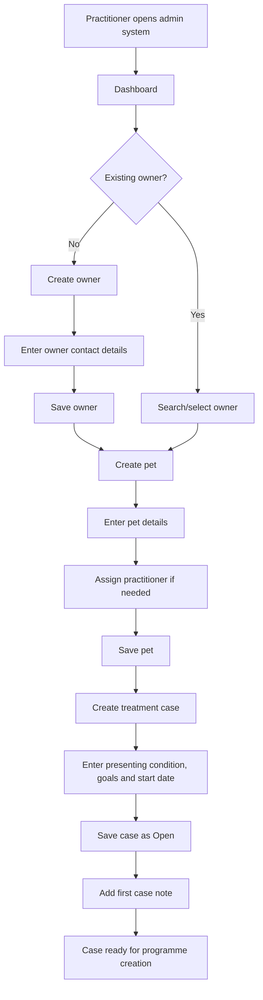

# Owner, Pet and Case Onboarding Workflow

```mermaid
flowchart TD
    A[Practitioner opens admin system] --> B[Dashboard]
    B --> C{Existing owner?}

    C -- No --> D[Create owner]
    D --> E[Enter owner contact details]
    E --> F[Save owner]

    C -- Yes --> G[Search/select owner]
    F --> H[Create pet]
    G --> H

    H --> I[Enter pet details]
    I --> J[Assign practitioner if needed]
    J --> K[Save pet]

    K --> L[Create treatment case]
    L --> M[Enter presenting condition, goals and start date]
    M --> N[Save case as Open]

    N --> O[Add first case note]
    O --> P[Case ready for programme creation]
```
