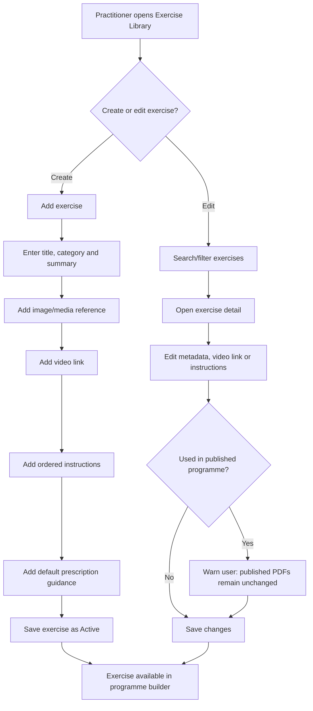

# Exercise Library Management Workflow

```mermaid
flowchart TD
    A[Practitioner opens Exercise Library] --> B{Create or edit exercise?}

    B -- Create --> C[Add exercise]
    C --> D[Enter title, category and summary]
    D --> E[Add image/media reference]
    E --> F[Add video link]
    F --> G[Add ordered instructions]
    G --> H[Add default prescription guidance]
    H --> I[Save exercise as Active]

    B -- Edit --> J[Search/filter exercises]
    J --> K[Open exercise detail]
    K --> L[Edit metadata, video link or instructions]
    L --> M{Used in published programme?}
    M -- No --> N[Save changes]
    M -- Yes --> O[Warn user: published PDFs remain unchanged]
    O --> N

    I --> P[Exercise available in programme builder]
    N --> P
```
