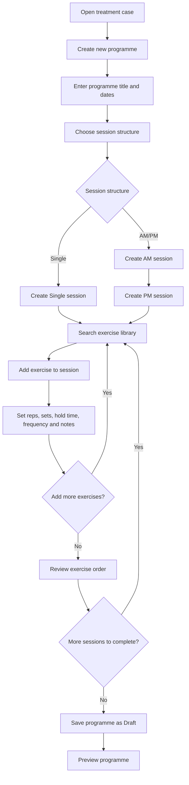

# Programme Creation Workflow

```mermaid
flowchart TD
    A[Open treatment case] --> B[Create new programme]
    B --> C[Enter programme title and dates]
    C --> D[Choose session structure]
    D --> E{Session structure}

    E -- Single --> F[Create Single session]
    E -- AM/PM --> G[Create AM session]
    G --> H[Create PM session]

    F --> I[Search exercise library]
    H --> I
    I --> J[Add exercise to session]
    J --> K[Set reps, sets, hold time, frequency and notes]
    K --> L{Add more exercises?}
    L -- Yes --> I
    L -- No --> M[Review exercise order]

    M --> N{More sessions to complete?}
    N -- Yes --> I
    N -- No --> O[Save programme as Draft]
    O --> P[Preview programme]
```
