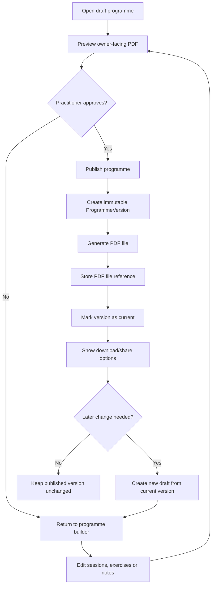

# PDF Preview, Publish and Versioning Workflow

```mermaid
flowchart TD
    A[Open draft programme] --> B[Preview owner-facing PDF]
    B --> C{Practitioner approves?}

    C -- No --> D[Return to programme builder]
    D --> E[Edit sessions, exercises or notes]
    E --> B

    C -- Yes --> F[Publish programme]
    F --> G[Create immutable ProgrammeVersion]
    G --> H[Generate PDF file]
    H --> I[Store PDF file reference]
    I --> J[Mark version as current]
    J --> K[Show download/share options]

    K --> L{Later change needed?}
    L -- Yes --> M[Create new draft from current version]
    M --> D

    L -- No --> N[Keep published version unchanged]
```
