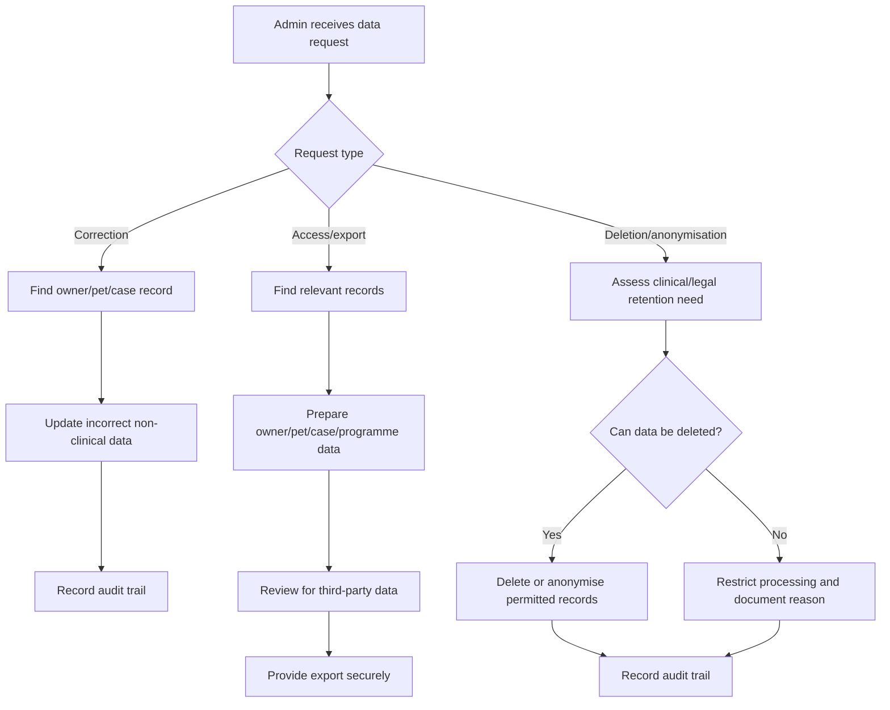

# GDPR and Data Control Workflow

```mermaid
flowchart TD
    A[Admin receives data request] --> B{Request type}

    B -- Correction --> C[Find owner/pet/case record]
    C --> D[Update incorrect non-clinical data]
    D --> E[Record audit trail]

    B -- Access/export --> F[Find relevant records]
    F --> G[Prepare owner/pet/case/programme data]
    G --> H[Review for third-party data]
    H --> I[Provide export securely]

    B -- Deletion/anonymisation --> J[Assess clinical/legal retention need]
    J --> K{Can data be deleted?}
    K -- Yes --> L[Delete or anonymise permitted records]
    K -- No --> M[Restrict processing and document reason]
    L --> N[Record audit trail]
    M --> N
```
