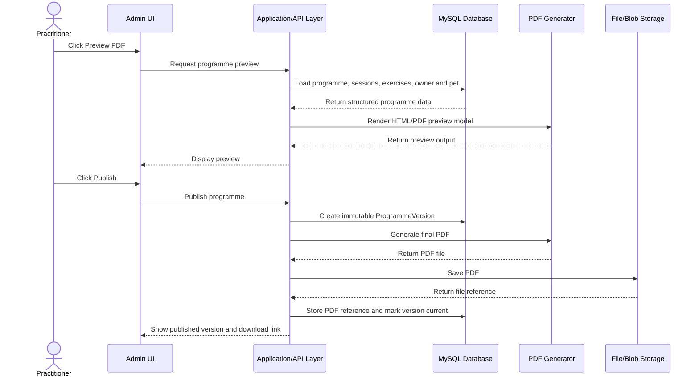

# PDF Generation Sequence

```mermaid
sequenceDiagram
    actor Practitioner
    participant AdminUI as Admin UI
    participant API as Application/API Layer
    participant DB as MySQL Database
    participant PDF as PDF Generator
    participant Store as File/Blob Storage

    Practitioner->>AdminUI: Click Preview PDF
    AdminUI->>API: Request programme preview
    API->>DB: Load programme, sessions, exercises, owner and pet
    DB-->>API: Return structured programme data
    API->>PDF: Render HTML/PDF preview model
    PDF-->>API: Return preview output
    API-->>AdminUI: Display preview

    Practitioner->>AdminUI: Click Publish
    AdminUI->>API: Publish programme
    API->>DB: Create immutable ProgrammeVersion
    API->>PDF: Generate final PDF
    PDF-->>API: Return PDF file
    API->>Store: Save PDF
    Store-->>API: Return file reference
    API->>DB: Store PDF reference and mark version current
    API-->>AdminUI: Show published version and download link
```
