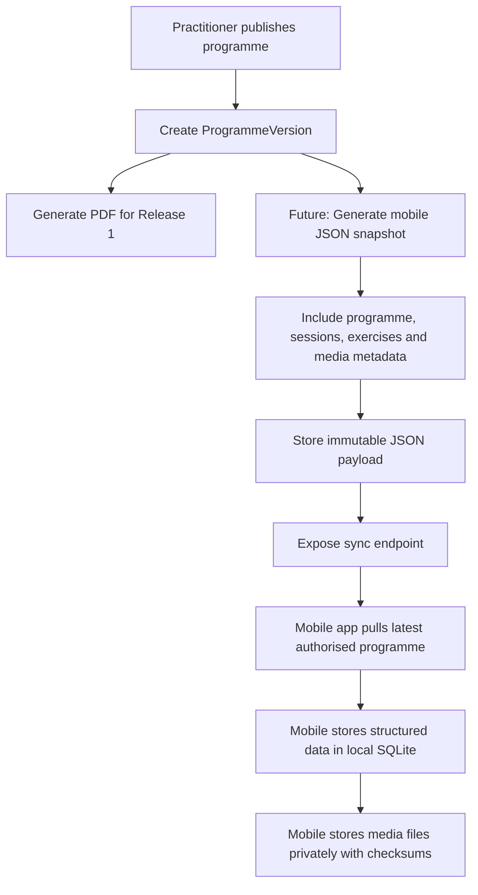

# Future Mobile JSON Publication Workflow

```mermaid
flowchart TD
    A[Practitioner publishes programme] --> B[Create ProgrammeVersion]
    B --> C[Generate PDF for Release 1]
    B --> D[Future: Generate mobile JSON snapshot]

    D --> E[Include programme, sessions, exercises and media metadata]
    E --> F[Store immutable JSON payload]
    F --> G[Expose sync endpoint]
    G --> H[Mobile app pulls latest authorised programme]
    H --> I[Mobile stores structured data in local SQLite]
    I --> J[Mobile stores media files privately with checksums]
```
