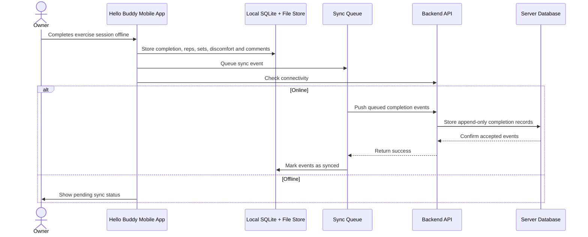

# Future Owner Progress and Offline Sync Workflow

```mermaid
sequenceDiagram
    actor Owner
    participant Mobile as Hello Buddy Mobile App
    participant LocalDB as Local SQLite + File Store
    participant Sync as Sync Queue
    participant API as Backend API
    participant DB as Server Database

    Owner->>Mobile: Completes exercise session offline
    Mobile->>LocalDB: Store completion, reps, sets, discomfort and comments
    Mobile->>Sync: Queue sync event

    Mobile->>API: Check connectivity
    alt Online
        Sync->>API: Push queued completion events
        API->>DB: Store append-only completion records
        DB-->>API: Confirm accepted events
        API-->>Sync: Return success
        Sync->>LocalDB: Mark events as synced
    else Offline
        Mobile->>Owner: Show pending sync status
    end
```
