# 3i. End-to-End Clinical Workflow — Swimlane View

Single end-to-end view of the practitioner journey through the Hello Buddy Canine Physiotherapy Admin: from a new owner enquiry, through assessment, programme creation, publication, follow-ups with revised exercises, and eventual case closure when the pet has recovered. Re-injury is shown as a loop back to a new case for the same pet.

**Reading the diagram**

- **Left-to-right** = time. Start is on the left, recovery on the right.
- **Three swimlanes** by actor:
  - **Practitioner** — clinical decisions and data entry (the bulk of the work).
  - **System** — automated steps the admin app performs (validation, version creation, PDF generation, archival).
  - **Owner — external** — happens outside the system in Release 1 (receiving and following the PDF programme).
- **Orange dashed halo** = the **"New patient journey" wizard** scope (Owner → Pet → Case as a single guided flow). Everything outside the halo is reached via the entity-based left navigation. See `Standards/coding-standards.md` §8 "Navigation patterns".
- **Diamonds** = decisions / gates.
- **Stadium shapes** = start, end, and external trigger states.
- Screen mapping for each step is shown in the table below the diagram rather than as in-line dotted lines, to keep the swimlane layout clean.

```mermaid
flowchart LR
    classDef process fill:#D4E0E5,stroke:#6392AE,stroke-width:1px,color:#28404F
    classDef decision fill:#B3CDD6,stroke:#28404F,stroke-width:1px,color:#28404F
    classDef terminal fill:#6392AE,stroke:#28404F,stroke-width:1.5px,color:#FFFFFF
    classDef system fill:#E6EFC2,stroke:#5A6E2D,stroke-width:1px,color:#2E3B14
    classDef external fill:#FFF7E0,stroke:#B58900,stroke-width:1px,color:#5C4A00

    START([Enquiry / referral]):::terminal

    subgraph PRACT [Practitioner]
        direction LR

        subgraph WIZ [New patient journey wizard]
            direction LR
            P1[Capture owner]:::process
            P2[Add pet]:::process
            P3[Open treatment case]:::process
            P1 --> P2 --> P3
        end

        P4[Record condition and goals]:::process
        P5[Add initial note]:::process
        P6{Library covers needs?}:::decision
        P7[Add or edit exercises]:::process
        P8[Create draft programme]:::process
        P9[Add exercises to sessions<br/>set reps, sets, hold, frequency]:::process
        P10[Refine prescription]:::process
        P11[Open in-page PDF preview]:::process

        P3 --> P4 --> P5 --> P6
        P6 -- No --> P7 --> P8
        P6 -- Yes --> P8
        P8 --> P9 --> P10 --> P11

        P16[Follow-up appointment]:::process
        P17[Add progress note]:::process
        P18{Clinical decision}:::decision
        P19[New draft from published]:::process
        P20[Swap or adjust exercises]:::process
        P21[Preview revised programme in-page]:::process
        P23[Final review]:::process
        P24[Discharge note and outcome]:::process
        P25[Close case]:::process
        ENDP([Case archived]):::terminal

        P16 --> P17 --> P18
        P18 -- Continue --> P16
        P18 -- Revise --> P19 --> P20 --> P21
        P18 -- Recovered --> P23 --> P24 --> P25 --> ENDP
    end

    subgraph SYS [System]
        direction LR
        S1{Validation passes?<br/>required fields, video links}:::decision
        S2[Create immutable version + PDF]:::system
        S3[Store PDF and metadata]:::system
        S4[Create new version v2 v3 ...]:::system
        S5[Archive case record]:::system
    end

    subgraph OWNER [Owner — external]
        direction LR
        O1[Receive PDF<br/>WhatsApp / email]:::external
        O2[Follow programme at home]:::external
        O3[Receive updated PDF]:::external
    end

    START --> P1
    P11 --> S1
    S1 -- No, fix --> P9
    S1 -- Yes --> S2 --> S3 --> O1 --> O2 --> P16
    P21 --> S4 --> O3 --> O2
    P25 --> S5

    REINJ([Re-injury or new condition<br/>future episode]):::terminal
    ENDP -. future episode .-> REINJ
    REINJ -. new case for same pet .-> P3

    style WIZ fill:#FFF3E0,stroke:#C8780E,stroke-width:2px,stroke-dasharray:6 4
    style PRACT fill:#F4F8FA,stroke:#6392AE,stroke-width:1px
    style SYS fill:#F7FAEE,stroke:#5A6E2D,stroke-width:1px
    style OWNER fill:#FFFCF0,stroke:#B58900,stroke-width:1px
```



## Phase to screen mapping

The diagram intentionally omits per-step screen labels to keep the swimlane layout readable. The mapping below covers every process step against the admin screens from `Canine Physio Requirements/04_admin_page_flow_and_layout.md`.

| Step         | Process                        | Screen(s) used                                      | Inside wizard? |
| ------------ | ------------------------------ | --------------------------------------------------- | -------------- |
| P1           | Capture owner                  | New owner → Owner detail                            | Yes            |
| P2           | Add pet                        | New pet → Pet detail                                | Yes            |
| P3           | Open treatment case            | New case → Case detail                              | Yes            |
| P4           | Record condition and goals     | Case detail (edit case)                             | No             |
| P5           | Add initial note               | Case note form (within Case detail)                 | No             |
| P6           | Library covers needs?          | (decision — Exercise library browse)                | No             |
| P7           | Add or edit exercises          | Exercise library → Exercise detail / Edit           | No             |
| P8           | Create draft programme         | Programme builder (new)                             | No             |
| P9           | Add exercises to sessions      | Programme builder (session editor)                  | No             |
| P10          | Refine prescription            | Programme builder (exercise card edit)              | No             |
| P11          | Open in-page PDF preview       | In-page PDF preview                                 | No             |
| S1           | Validation gate                | In-page PDF preview (validation panel)              | n/a            |
| S2           | Create immutable version + PDF | Published programme page                            | n/a            |
| S3           | Store PDF and metadata         | (background — surfaces on Published programme page) | n/a            |
| P16          | Follow-up appointment          | Case detail                                         | No             |
| P17          | Add progress note              | Case note form                                      | No             |
| P18          | Clinical decision              | Case detail                                         | No             |
| P19          | New draft from published       | Published programme page → Programme builder        | No             |
| P20          | Swap or adjust exercises       | Programme builder                                   | No             |
| P21          | Preview revised programme      | In-page PDF preview                                 | No             |
| S4           | Create new version v2/v3…      | Version history                                     | n/a            |
| P23          | Final review                   | Case detail                                         | No             |
| P24          | Discharge note and outcome     | Case note form                                      | No             |
| P25          | Close case                     | Case detail (close case action)                     | No             |
| S5           | Archive case record            | (background)                                        | n/a            |
| O1 / O2 / O3 | Owner steps                    | None — out of system in Release 1                   | n/a            |

## Notes on the workflow

1. **Wizard scope** (orange dashed halo) covers the three-step "New patient journey" — Owner → Pet → Case. The wizard is a thin Razor shell composing the same `_OwnerForm`, `_PetForm` and `_CaseForm` partials used by the standalone entity pages. See `Standards/coding-standards.md` §8 "Navigation patterns".
2. **Out-of-system steps** (Owner lane, amber) influence the design but are not built in Release 1. Architecture must not block the future mobile/owner-app increments.
3. **Version immutability**: every revision pass through the System lane produces a new immutable `ProgrammeVersion` (v2, v3, …). The previous version's PDF is never overwritten, satisfying AC-018.
4. **Validation gate (S1)** is shown explicitly in the System lane so the practitioner-side "fix issues" loop is obvious. The validator runs the same rule set in preview and at publish (see `Standards/coding-standards.md` §6).
5. **In-life loop** (P16 → P18 → P16) is the steady state between follow-up appointments — most cases iterate here several times before reaching either Revise or Recovered.
6. **Re-injury loop**: closing a case is final. A future episode opens a **new** treatment case for the same pet, keeping clinical history clean and auditable. The dotted arrow back to P3 is informational, not a real screen flow.

## Exporting to SVG

Open this file in VS Code preview (or on GitHub), right-click the rendered diagram, and choose **Save as SVG** / **Copy as SVG**. For a scripted export:

```powershell
npx -p @mermaid-js/mermaid-cli mmdc -i "Designs/03i_mermaid_end_to_end_clinical_journey.md" -o "Designs/end_to_end.svg"
```
