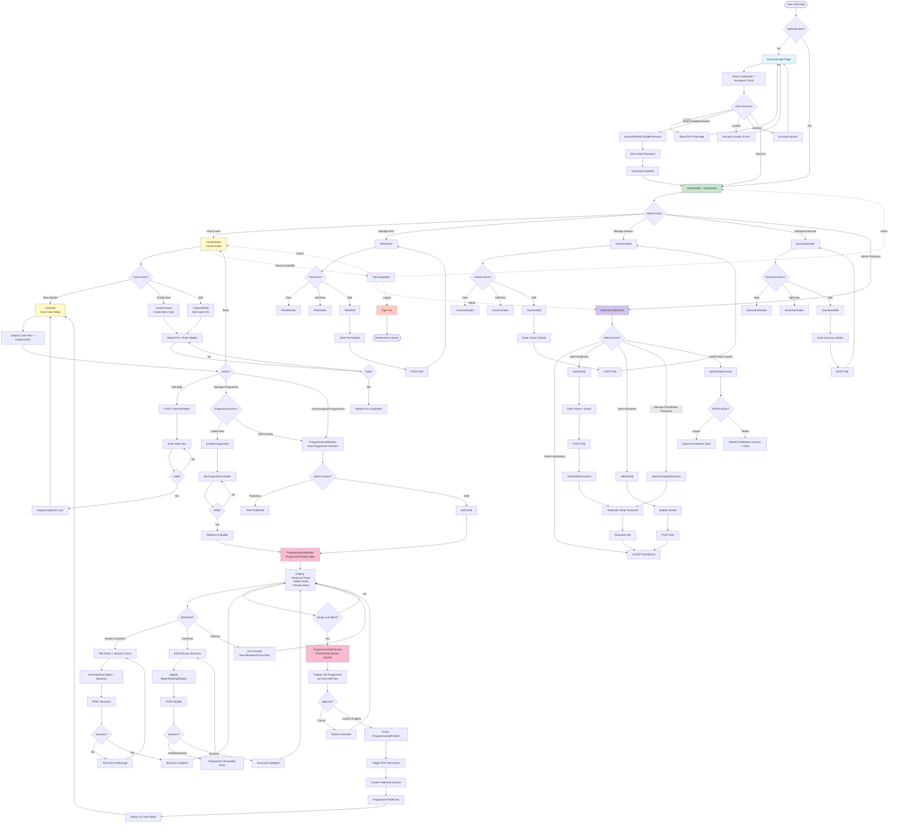

# Canine Physio Admin - Workflow Diagram

## Main Admin Application Workflow



## User Workflows by Role

### Practitioner Workflow (Main User)
1. **Login** → Account/Login
2. **View Dashboard** → Home/Index
3. **Select Case** → Cases/Index → Select Case
4. **View Case Details** → Cases/{id} → View Programme Status
5. **Build Programme** → Programmes/{id}/Builder
   - Edit Structure (dates/sessions)
   - Edit Exercises (reps/sets/duration)
   - Live Preview
6. **Publish Programme** → Programmes/{id}/Preview → Publish
7. **Add Case Notes** → Cases/{id}/Notes
8. **Manage Supporting Data** → Pets/Owners/Exercises as needed

### Administrator Workflow
1. **Login** → Account/Login
2. **Navigate to Admin** → Admin/Practitioners
3. **Manage Practitioners**
   - Add new practitioner → Admin/Add
   - Set password → Admin/SetPassword
   - Edit practitioner → Admin/Edit
   - Change password → Admin/ChangePassword
4. **GDPR Data Control** → Admin/DataControl
   - Export practitioner data
   - Delete practitioner account & associated data

### New Practitioner Onboarding
1. Receive email with temporary password (Admin/SetPassword)
2. Login → Account/Login
3. Forced password change → Account/MustChangePassword
4. Access main dashboard → Home/Index

## Key Data Dependencies

- **Cases** depend on **Pets** (PetId)
- **Pets** depend on **Owners** (OwnerId)
- **Programmes** depend on **Cases** (CaseId)
- **Programmes** contain **Exercises** and **Sessions**
- **Case Notes** are attached to **Cases**
- **Practitioners** are isolated per practitioner (X-Practitioner-Id header)

## Security Features

- **Authentication**: Cookie-based after login
- **Authorization**: [Authorize] attribute on protected routes
- **Anti-forgery**: [ValidateAntiForgeryToken] on POST actions
- **Honeypot**: Bot detection on login form
- **Account Lockout**: 15-minute lockout after failed attempts
- **Practitioner Isolation**: API enforces X-Practitioner-Id header (via middleware)
- **GDPR Compliance**: Data export/deletion via Admin/DataControl

## View Structure

```
Views/
├── Home/
│   ├── Index.cshtml (Dashboard)
│   └── AccessDenied.cshtml
├── Account/
│   ├── Login.cshtml
│   └── MustChangePassword.cshtml
├── Cases/
│   ├── Index.cshtml (List)
│   └── Edit.cshtml (Create/Edit)
├── CaseDetail/
│   └── Index.cshtml (Detail + Notes)
├── Programmes/
│   ├── Builder.cshtml (Main builder)
│   ├── History.cshtml (Version history)
│   ├── Preview.cshtml (Final preview)
│   ├── _BuilderEditor.cshtml (Editor panel)
│   ├── _BuilderPreviewPane.cshtml (Live preview)
│   └── _ProgrammePreviewDocument.cshtml (Document template)
├── Owners/
│   ├── Index.cshtml
│   ├── Details.cshtml
│   └── Edit.cshtml
├── Pets/
│   ├── Index.cshtml
│   ├── Details.cshtml
│   └── Edit.cshtml
├── Exercises/
│   ├── Index.cshtml
│   ├── Details.cshtml
│   └── Edit.cshtml
└── Admin/
    ├── Practitioners.cshtml (List)
    ├── Add.cshtml
    ├── Edit.cshtml
    ├── SetPassword.cshtml
    ├── ChangePassword.cshtml
    └── DataControl.cshtml (GDPR)
```
