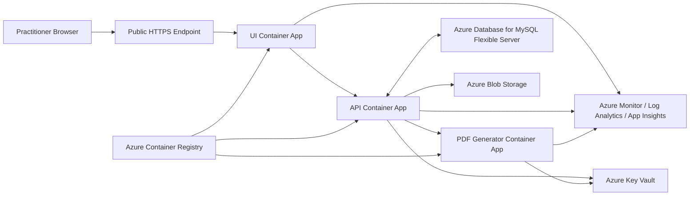

# Hello Buddy Cloud Admin

## Azure Architecture Diagram Specification

## Purpose

This document defines the exact diagram content for the Azure deployment architecture so it can be recreated consistently in Mermaid, draw.io, PowerPoint, Visio, or another diagramming tool.

It is intended for the assessment architecture diagram section and should align with the chosen Azure Container Apps deployment model.

## Diagram Objective

The diagram should show:

- the single public entry point;
- the three-container application split;
- internal-only service boundaries;
- durable data and object storage;
- monitoring and secret management;
- the fact that only the UI is public-facing.

## Recommended Diagram Title

Hello Buddy Cloud Admin - Azure Production Architecture

## Core Components To Show

### Public edge

- Practitioner browser
- Optional custom domain and DNS
- Optional Azure Front Door or direct Container Apps ingress

### Application layer

- `hello-buddy-ui` container app
- `hello-buddy-api` container app
- `hello-buddy-pdf` container app

### Data and platform services

- Azure Database for MySQL Flexible Server
- Azure Blob Storage
- Azure Key Vault
- Azure Monitor / Log Analytics / Application Insights
- Azure Container Registry

## Logical Flow To Show

The main request and publish flow should be represented like this:

1. Practitioner accesses the public UI.
2. UI calls the internal API.
3. API reads and writes structured data in MySQL.
4. API calls the PDF service during preview or publish.
5. PDF output is stored in Blob Storage.
6. API stores PDF metadata in MySQL.
7. Telemetry flows to monitoring services.

## Recommended Diagram Layout

Use a left-to-right layout.

### Left column

- Practitioner Browser

### Next column

- Azure public entry point
  - custom domain or Azure Front Door
  - public HTTPS ingress

### Centre column

- UI container app
- API container app
- PDF container app

UI should be above API, and API above PDF.

### Right column

- MySQL Flexible Server
- Blob Storage
- Key Vault
- Azure Monitor / Log Analytics / Application Insights

### Top or bottom supporting element

- Azure Container Registry feeding the three container apps

## Connection Rules

Show these directed connections:

### Public request flow

- Practitioner Browser -> Public HTTPS Endpoint
- Public HTTPS Endpoint -> `hello-buddy-ui`

### Internal service flow

- `hello-buddy-ui` -> `hello-buddy-api`
- `hello-buddy-api` -> `hello-buddy-pdf`

### Data flow

- `hello-buddy-api` <-> MySQL Flexible Server
- `hello-buddy-api` -> Blob Storage
- `hello-buddy-pdf` -> `hello-buddy-api` or Blob Storage depending on chosen implementation note

### Configuration and monitoring flow

- `hello-buddy-api` -> Key Vault
- `hello-buddy-pdf` -> Key Vault if needed
- all three container apps -> Azure Monitor / Log Analytics / Application Insights
- Azure Container Registry -> all three container apps

## Boundary Rules

The diagram should visually distinguish:

### Public boundary

Only these should appear in the public access path:

- Browser
- Public endpoint
- UI container app

### Internal application boundary

These should be shown as internal/private:

- API container app
- PDF container app

### Private data boundary

These should be shown as private platform services:

- MySQL Flexible Server
- Blob Storage
- Key Vault

## Labels To Put On The Diagram

Use short labels that map cleanly to the report.

Recommended labels:

- Practitioner Browser
- Public HTTPS Ingress
- UI Container App
- API Container App
- PDF Generator Container App
- Azure Database for MySQL Flexible Server
- Azure Blob Storage
- Azure Key Vault
- Azure Monitor / Log Analytics / Application Insights
- Azure Container Registry

## Annotation Notes To Include

Add brief diagram callouts for these points:

1. Only the UI is public-facing.
2. API and PDF services are internal only.
3. PDF generation is isolated to its own container for independent scaling.
4. MySQL stores structured business data.
5. Blob Storage stores published PDF outputs.

## Assessment-Focused Callouts

If space allows, include small callouts or legend notes for:

- independent scaling per service;
- scale-to-zero on internal services;
- managed services used to reduce operational overhead;
- AKS evaluated but rejected due to cost and complexity for this workload.

## Mermaid Starter Specification

This can be used as a starting point for a Mermaid diagram.

## Diagram Caption Suggestion

The Hello Buddy Cloud Admin production architecture uses Azure Container Apps to host three independently deployable services. Only the practitioner UI is exposed publicly; the API and PDF generator remain internal. Structured business data is stored in Azure Database for MySQL Flexible Server, while published PDFs are stored in Azure Blob Storage. Monitoring, telemetry, and secure secret management are provided through Azure-native managed services.

## Recommendation

Keep the final diagram simple enough to read in one glance. The marker should be able to understand the public edge, service separation, and storage model immediately, without reading a large amount of supporting text.
