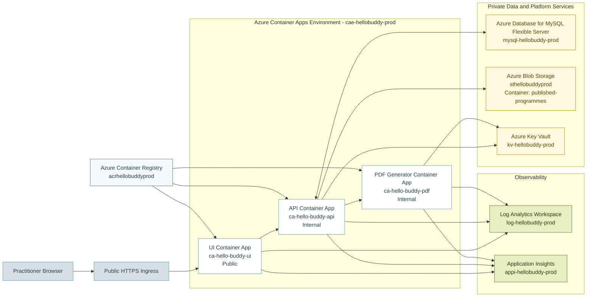

# Hello Buddy Cloud Admin

## Azure Production Architecture Diagram

## Mermaid Diagram

## Caption

The Hello Buddy Cloud Admin production environment uses Azure Container Apps to host three independently deployable workloads. Only the UI container is publicly exposed. The API and PDF generator remain internal services inside the shared Container Apps environment. Structured business data is stored in Azure Database for MySQL Flexible Server, while published PDF outputs are stored in Azure Blob Storage. Secure configuration and observability are provided through Azure Key Vault, Log Analytics, and Application Insights.

## Notes For Export

- Use this Mermaid diagram directly in Markdown-capable tooling if supported.
- For submission visuals, export the rendered diagram to SVG or PNG so labels remain crisp in the PDF report.
- If the diagram feels too dense in portrait format, move observability to a side note box rather than the main flow.
