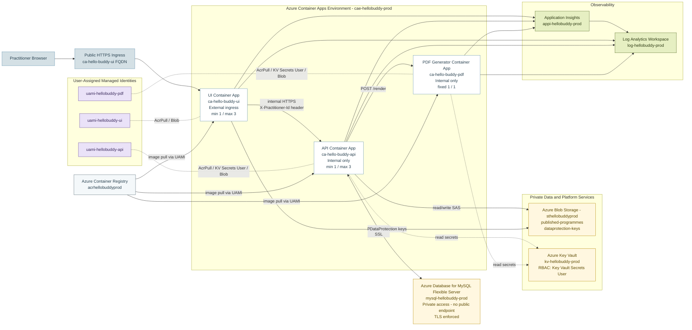
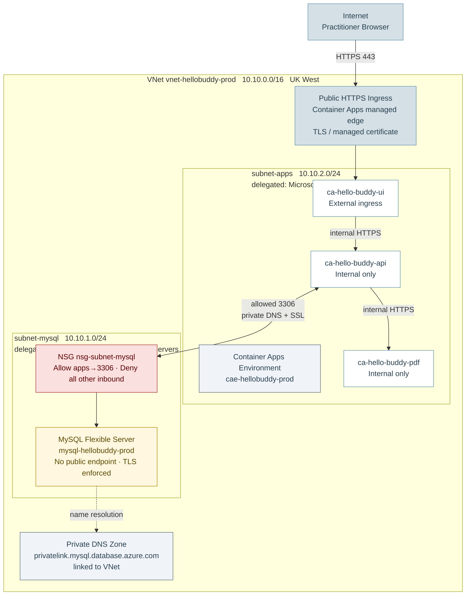

# Hello Buddy Cloud Admin

## Azure Production Architecture Diagram

> **Region:** UK West &nbsp;|&nbsp; **Resource Group:** `rg-hellobuddy-prod` &nbsp;|&nbsp; **As deployed: 30 May 2026**
>
> This document is the source of truth for recreating the diagram in Lucidchart. The Mermaid below shows the as-built **logical application architecture** — the public edge, the three services, data/secret flows, identities, and observability. The VNet, subnets, address spaces, and private DNS detail live in the separate **Network Diagram** section further down (the brief asks for one architecture diagram *and* one deployment/network diagram).

## Mermaid Diagram — Architecture (logical)

## Mermaid Diagram — Network / Deployment Topology

This view shows the as-built network design: a single VNet with two delegated subnets, the public ingress edge, and private-only connectivity to MySQL over a private DNS zone. Tier isolation is layered: **HTTPS is enforced at the Container Apps ingress** (`allowInsecure = false`, an L7 control); the **API and PDF** apps are **internal-only** (`external = false`); and **MySQL** uses **private access** with no public endpoint. As defence-in-depth, an **NSG (`nsg-subnet-mysql`)** is applied to the MySQL subnet with an explicit L4 rule allowing inbound `3306` **only** from `subnet-apps` and denying all other inbound. No NSG is placed on `subnet-apps` because it is delegated to `Microsoft.App/environments` (platform-managed networking) and HTTPS is already enforced at the ingress layer.

## Caption

The Hello Buddy Cloud Admin production environment runs in **UK West** and uses Azure Container Apps to host three independently deployable workloads inside a single VNet-integrated environment (`cae-hellobuddy-prod`). Only the **UI** container app is publicly exposed; the **API** and **PDF generator** are internal-only and unreachable from the public internet. Inter-service calls from UI to API carry an `X-Practitioner-Id` header that the API enforces to scope every query to the authenticated practitioner.

Structured business data is held in **Azure Database for MySQL Flexible Server**, deployed with **private access** into a delegated subnet (`subnet-mysql`) so it has no public endpoint and is resolved over a private DNS zone with TLS enforced. As an additional defence-in-depth layer, a **network security group (`nsg-subnet-mysql`)** is attached to that subnet and permits inbound `3306` only from the Container Apps subnet (`subnet-apps`), denying all other inbound traffic. Published programme PDFs and ASP.NET Core Data Protection keys are stored in two separate **Blob Storage** containers (`published-programmes`, `dataprotection-keys`). Programme downloads are issued via time-limited **SAS** URLs rather than anonymous access; the Data Protection keys are written and read by the UI's managed identity.

Security is identity-based throughout: each container app has its own **user-assigned managed identity** with least-privilege RBAC — `AcrPull` for image pulls, `Key Vault Secrets User` for configuration, and narrowly scoped `Storage Blob Data Contributor` on individual blob containers. The **API and PDF** services read their secrets (MySQL connection string, Application Insights connection string) from **Key Vault** directly via managed identity — not via Container Apps secret references. The **UI** does not read Key Vault; it writes ASP.NET Core Data Protection keys to the `dataprotection-keys` blob container using its managed identity. Observability flows from all three apps into **Application Insights** and **Log Analytics**.

## Lucidchart Build Guide

Use these exact node labels and groupings when rebuilding in Lucidchart.

### Containers (grouping boxes)

| Group box | Contains | Border style |
|-----------|----------|--------------|
| Virtual Network `vnet-hellobuddy-prod` | Container Apps Environment + MySQL subnet | Solid, blue |
| Container Apps Environment `cae-hellobuddy-prod` (nested in VNet) | UI, API, PDF apps | Solid, blue (inner) |
| Delegated Subnet `subnet-mysql` (nested in VNet) | MySQL Flexible Server + NSG `nsg-subnet-mysql` | Dashed, amber |
| User-Assigned Managed Identities | 3 UAMI nodes | Solid, purple |
| Private Data & Platform Services | Blob Storage, Key Vault | Solid, amber |
| Observability | Log Analytics, App Insights | Solid, green |

### Nodes

| Node | Label text | Notes |
|------|-----------|-------|
| Practitioner Browser | `Practitioner Browser` | External actor, left edge |
| Public Ingress | `Public HTTPS Ingress` | Only entry point |
| UI app | `ca-hello-buddy-ui` — External, min 1 / max 3 | Public container app |
| API app | `ca-hello-buddy-api` — Internal, min 1 / max 3 | No public ingress |
| PDF app | `ca-hello-buddy-pdf` — Internal, fixed 1/1 | PuppeteerSharp/Chromium |
| MySQL | `mysql-hellobuddy-prod` — Private access, TLS enforced | No public endpoint |
| Blob | `sthellobuddyprod` — published-programmes, dataprotection-keys | Two containers |
| Key Vault | `kv-hellobuddy-prod` — RBAC Key Vault Secrets User | Direct MI read |
| ACR | `acrhellobuddyprod` | UAMI AcrPull |
| Log Analytics | `log-hellobuddy-prod` | |
| App Insights | `appi-hellobuddy-prod` | Feeds Log Analytics |
| UAMI x3 | `uami-hellobuddy-ui/api/pdf` | One per app |

### Connections (with labels)

| From | To | Label | Line style |
|------|----|-------|-----------|
| Browser | Public Ingress → UI | HTTPS | Solid arrow |
| UI | API | internal HTTPS + `X-Practitioner-Id` header | Solid arrow |
| API | PDF | `POST /render` | Solid arrow |
| API | MySQL | private DNS + SSL | Solid double arrow |
| API | Blob | read/write via SAS | Solid arrow |
| UI | Blob | DataProtection keys | Solid arrow |
| API / PDF | Key Vault | read secrets (managed identity) | Dotted arrow |
| ACR | UI / API / PDF | image pull via UAMI AcrPull | Solid arrow |
| UI / API / PDF | App Insights → Log Analytics | telemetry | Solid arrow |
| UAMI x3 | their app | grants AcrPull / KV / Blob RBAC | Dotted (association) |

### Key distinction-tier points to highlight visually

- **Trust boundary:** draw a clear line so only the UI sits outside the internal boundary; API + PDF + MySQL are inside and unreachable publicly.
- **No public DB:** MySQL has no public endpoint (private access, delegated subnet, private DNS).
- **Identity-based, least-privilege access:** every cross-resource arrow is backed by a managed identity with a narrowly scoped role — no shared keys or admin credentials.
- **Two blob containers:** keep `published-programmes` and `dataprotection-keys` distinct.

## Notes For Export

- The Mermaid above renders in Markdown-capable tooling; use it to sanity-check the topology before drawing in Lucidchart.
- For the submission, export the final Lucidchart diagram to SVG or PNG so labels stay crisp in the PDF report.
- If portrait layout feels dense, move Observability into a side panel and keep the request path (Browser → UI → API → PDF/DB/Blob) as the visual spine.
