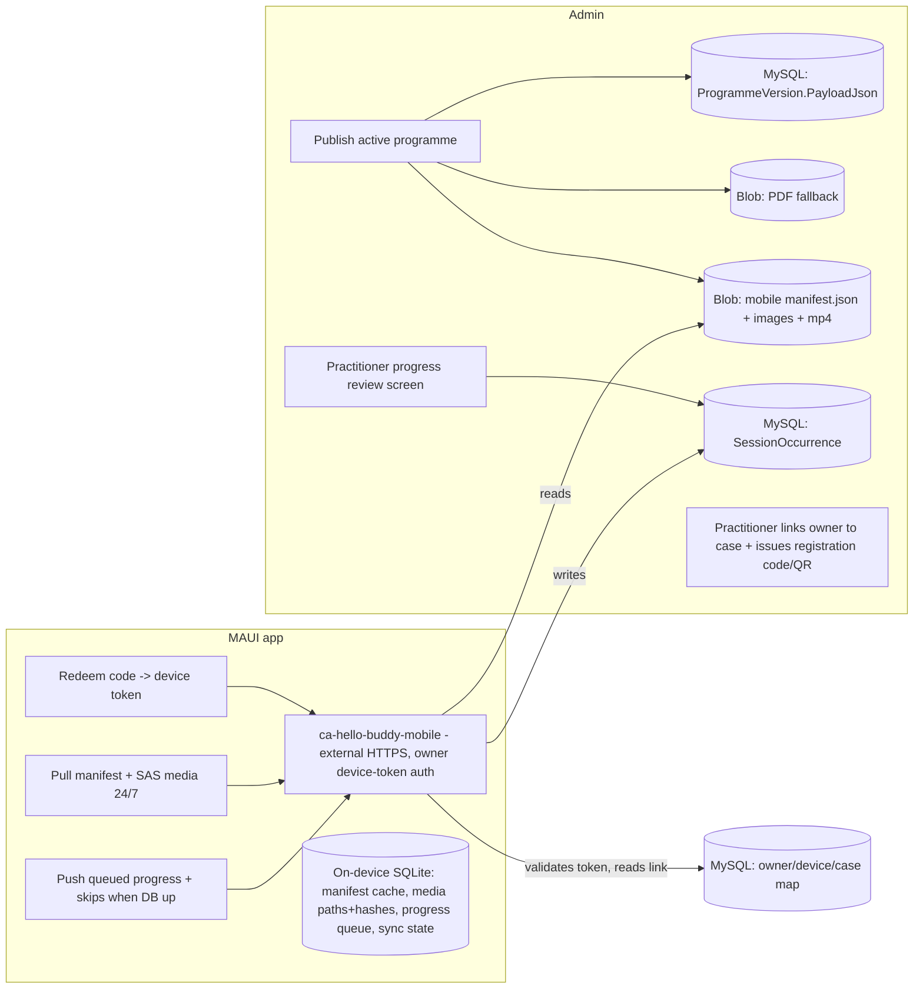

# Release 3 Epic and Increment Stories — Integrated Mobile + Admin

**Created:** 2026-06-28
**Status:** Draft for execution (solution design agreed with product owner)
**Scope:** Hello Buddy — Canine Physiotherapy **Admin** (`Canine Physio Admin`) + **Mobile App** (`Canine Physio App`)
**Implementation model:** AI-led implementation (Sonnet, measured in minutes) + human testing (~1 hour per story to test, identify issues, and re-test). Estimates include a 20% contingency for bug fixes and rework. Azure deployments add an approximate cloud wait/provisioning allowance.

> **Standards:** All admin work follows [Standards/coding-standards.md](../../Standards/coding-standards.md) and the admin `docs/adr` conventions (clean-architecture-lite, async + `CancellationToken` end-to-end, repositories return aggregates not `IQueryable`, immutable published versions, domain language — "programme" never "program", constructor injection, EF Core 9 database-first, `TreatWarningsAsErrors`). All mobile work follows the conventions in [Canine Physio App/DecisionLog.md](../../Canine%20Physio%20App/DecisionLog.md) and [Canine Physio App/DatabaseDesignBrief.md](../../Canine%20Physio%20App/DatabaseDesignBrief.md). Any deviation requires an ADR + a one-line `DecisionLog` entry.

---

## Epic: Fully Integrated Mobile + Admin with Near-Real-Time Data Exchange

Connect the .NET MAUI mobile app to the admin system so owners pull their **active** programme (exercises, instructions, images, and videos) onto the device and push back exercise progress and skips, giving practitioners a progress-review capability — while the interim PDF remains a fallback for owners who do not adopt the app.

### Epic outcomes

- A published **active** programme is staged to blob storage as an immutable, versioned **mobile manifest** (data + media), so the app can pull it **24/7 even while the database is switched off out of hours**.
- The mobile app pulls its programme over a **new dedicated mobile container app** and stores working data in an on-device **SQLite** database (replacing the current static XML/JSON working data).
- The app **stores exercise images and MP4 videos on the device** and **clears them out on programme updates**, downloading only changed media (hash-diffed) to keep package size and download times low.
- The app **pushes exercise progress and skips** back to the admin database (queued locally, synced when the database is available).
- Practitioners get an **in-admin progress-review** screen showing each patient's session/exercise progress, discomfort, and skips.
- The app's **static text content** (about/terms/warnings) is editable from an **admin-only** content editor and **auto-updates** on devices via blob (no app-store release).
- **Only active programmes** can be loaded to the app; the PDF publish path is unchanged and remains the fallback.

### Epic non-goals

- Replacing the PDF path (it stays as the fallback for non-app owners).
- Owner self-service programme renewal (a practitioner must always prescribe the next programme — per `DatabaseDesignBrief`).
- Real-time push notifications / websockets (Release 3 is pull + queued writeback, "near-real-time", not live push).
- Multi-pet device switching beyond the linked case in scope (single active programme per device for this release).
- Replacing `X-Practitioner-Id` admin auth (TD-005) — only the **mobile-facing** API gets the new owner auth.

---

## Solution design (agreed)

**Key design decisions (this release):**

1. **Blob-first manifest for out-of-hours availability.** Publish writes an immutable, versioned mobile manifest to blob (e.g. `mobile/case-{caseId}/v{version}/manifest.json`) plus the media files. The mobile API serves the manifest and issues SAS media URLs by **reading blob, not the database**, so the app can pull a fresh programme **even while MySQL is stopped** (Mon–Fri ~19:00–06:00/07:00 + weekends, per DEC-002). The database is needed only for progress **writeback** and for token validation/linking (which happen during uptime; writes queue otherwise).
2. **Managed MP4 in blob.** Exercise videos move from external Google Drive links to **managed MP4 uploads in blob** (mirroring how images are already managed), so the app can download and store MP4 on the device for offline playback. (Google Drive links remain valid for the admin/PDF interim path where still used.)
3. **Owner device-token auth.** A practitioner **links an owner account to a case** in admin and **issues a one-time registration code/QR**. The owner redeems it once on the device; the mobile API returns a long-lived **device token (JWT)** bound to that owner + case. Subsequent launches reuse the stored token. This is separate from the practitioner `X-Practitioner-Id` path.
4. **SQLite replaces XML for working data.** The app adds SQLite (`sqlite-net-pcl`) for mutable working data: cached manifest, downloaded-media file paths + content hashes, the **progress/skip queue**, and **sync state**. Static `AppContent.json` (about/terms/warnings) stays as bundled JSON. SQLite is chosen over XML because the working data is now **mutable, queryable, and transactional** (today's session, completion state, pending-sync rows, hash-diff lookups) — XML suited a single static read-only blob but is poor for a sync queue.
5. **Media lifecycle.** Manifest carries per-file content hashes. On a new/updated programme the app **purges superseded media + rows** and downloads only changed files, showing download progress. Bundled sample media is removed from the app package to shrink install size; media is pulled on demand after redemption.
6. **Reuse what exists.** Progress capture UI already exists in the app (`ExerciseProgressPage`: actual reps/sets, discomfort 0–10, comments; skip via `SessionStateService`) but is currently discarded — wire it to the SQLite queue + sync. The `SessionOccurrence` table already exists in the schema (with `DeviceRecordedDateTime`, `Started/Completed/SkippedDateTime`, `SyncedDateTime`, `Comments`, `Status` including `'skipped'`) and is the writeback landing table.

---

## Story Index

| ID | Title | Increment |
|----|-------|-----------|
| R3-S1 | Managed exercise video (MP4) in blob + blob video-library setting + thumbnail retarget | Increment 13 |
| R3-S2 | Mobile manifest publish to blob (out-of-hours pull) | Increment 13 |
| R3-S3 | Owner ↔ case linking + registration code/QR + device token | Increment 14 |
| R3-S4 | New mobile-facing container app + mobile API (pull) | Increment 14 |
| R3-S5 | Mobile SQLite working store + programme pull/cache | Increment 15 |
| R3-S6 | Mobile media download + on-device store + update purge | Increment 15 |
| R3-S7 | Progress + skip writeback (app queue → SessionOccurrence) | Increment 16 |
| R3-S8 | Practitioner progress-review screen (admin) | Increment 16 |
| R3-S10 | Mobile static-content editor (admin-only) + auto content update | Increment 16 |
| R3-S9 | End-to-end integration + Azure deploy of mobile tier | Increment 17 |

---

## Increment 13: Publish data + media to blob

### Story R3-S1: Managed exercise video (MP4) in blob

#### a) User story and brief for Sonnet
**User story**
As a practitioner, I want to upload an exercise's demonstration video as a managed MP4 (stored like the exercise image) so that the mobile app can download and play it on the device offline.

**Brief for Sonnet**
Current state: `Exercise.ImageUrl` is a managed blob asset (uploaded via `POST /api/exercises/media`, scanned, stored in `published-programmes`, served through `IFileStore`); `Exercise.VideoUrl` is an **external Google Drive link only** ([Canine Physio Admin/src/HelloBuddy.Admin.Core/Data/Generated/Exercise.cs](../../Canine%20Physio%20Admin/src/HelloBuddy.Admin.Core/Data/Generated/Exercise.cs)). The video-selection popup lives in [Edit.cshtml](../../Canine%20Physio%20Admin/src/HelloBuddy.Ui/Views/Exercises/Edit.cshtml).
Implement:
1. Extend the exercise media flow to accept a **managed MP4 upload** (new column or reuse a managed `VideoUrl` pointing at a blob key, e.g. `exercise-media/video/{key}.mp4`). Mirror the existing image governance ([ExerciseMediaGovernanceService.cs](../../Canine%20Physio%20Admin/src/HelloBuddy.Api/Services/ExerciseMediaGovernanceService.cs)) for orphan cleanup on replace.
2. API: extend `POST /api/exercises/media` (or add `/api/exercises/media/video`) to accept video content-type, enforce a size limit + allowed type (`video/mp4`), virus-scan as images are, and return the managed URL. Keep the external-link option available (admin/PDF interim path).
3. UI: in the exercise Edit video section, allow **upload MP4** alongside the existing "Search video"/paste-URL option; show which source is in use.
4. DB: idempotent update script under `Canine Physio Database/Build and Initialise/` if a new column is needed (e.g. `ManagedVideoUrl` / `VideoBlobKey`), safe for production.
5. **Blob video-library setting (extends Phase 2 R2-S3):** in Phase 2 the Settings page holds a configurable **Google Drive** video-library URL (`VideoLibrary.GoogleDriveUrl`). Add a second, **blob-storage video-library** setting (e.g. `VideoLibrary.BlobUrl` / managed-blob container reference) on the same admin Settings page so practitioners can browse/select from the managed blob library. The video-selection popup gains a **"Managed (blob)"** provider option resolved from this setting, alongside the existing Drive option. Reuse the Phase 2 `AppSetting` store/page/API + `AdminOnly` gating — do not create a parallel mechanism.
6. **Retarget the thumbnail generator (Phase 2 R2-S6) to blob:** update the `tools/video-thumbnails/` script to run against the **managed MP4 in blob** (deterministic keys via `IFileStore`, no Drive auth) and **upload the generated JPG as the exercise's managed image / video poster** used on-device. Idempotent; honour media governance.
7. Tests: in-memory API test for upload validation + governance; UI test for the upload control; setting persists + popup shows the blob provider; thumbnail script produces + uploads a poster for a managed MP4.
Constraints: follow the existing media-governance pattern; do not break the external-link path used by the PDF/interim flow. Respect `TreatWarningsAsErrors`, async + `CancellationToken`. Reuse Phase 2 settings infrastructure.

#### b) Estimate (incl. 20% contingency)
| Phase | Base | With 20% |
|-------|------|----------|
| AI implementation (media endpoint + governance + column + UI + blob video-library setting + thumbnail retarget + tests) | ~30 min | ~36 min |
| Human testing (upload mp4, replace, orphan cleanup, playback URL, blob provider in popup, thumbnail upload) | 1.25 h | 1.5 h |
| Azure deploy (API+UI image) hands-on + rollout wait | ~25 min | ~30 min |
| **Total** | **~2.25 h** | **~2.6 h** |

---

### Story R3-S2: Mobile manifest publish to blob (out-of-hours pull)

#### a) User story and brief for Sonnet
**User story**
As the system, when a practitioner publishes an **active** programme, I want an immutable, versioned mobile manifest (programme data + media references) written to blob storage so that the mobile app can pull the programme at any time, including while the database is switched off.

**Brief for Sonnet**
Current state: `ProgrammeService.PublishAsync` ([Canine Physio Admin/src/HelloBuddy.Application/Programmes/ProgrammeService.cs](../../Canine%20Physio%20Admin/src/HelloBuddy.Application/Programmes/ProgrammeService.cs)) builds the full `ProgrammeVm` (sessions → exercises → instructions, reps/sets/hold, media URLs), serializes it to `ProgrammeVersion.PayloadJson`, and writes a PDF to blob via `IFileStore`.
Implement:
1. In/after `PublishAsync`, when the programme is **active**, also write a **mobile manifest** JSON to blob at a stable, versioned key, e.g. `mobile/case-{caseId}/v{versionNumber}/manifest.json`, plus a pointer `mobile/case-{caseId}/current.json` (atomically updated) naming the current version. Manifest schema = programme + sessions + exercises + instructions + reps/sets/hold + **media entries** each with `{ relativeKey, contentType, sizeBytes, sha256 }` for image and MP4, plus `payloadSchemaVersion`.
2. Stage the **media files** (managed exercise images + managed MP4 from R3-S1) into the same `mobile/case-{caseId}/v{version}/media/...` prefix so the manifest references are self-contained.
3. Manifest is **immutable per version** (matches the immutable `ProgrammeVersion` rule). Superseding a version writes a new folder and repoints `current.json`.
4. Only **active** programmes produce a manifest; cancelled/completed do not (and the pointer is removed/retired).
5. Tests: integration test that publish writes manifest + current pointer + media with correct hashes; assert immutability (re-publish creates new version folder).
Constraints: reuse `IFileStore`; keep PDF path unchanged; async + `CancellationToken`; use the existing domain language. Record an ADR for the manifest schema + blob layout.

#### b) Estimate (incl. 20% contingency)
| Phase | Base | With 20% |
|-------|------|----------|
| AI implementation (manifest builder + media staging + pointer + ADR + tests) | ~25 min | ~30 min |
| Human testing (publish active programme, inspect blob layout + hashes + pointer) | 1.0 h | 1.2 h |
| Azure deploy (API image) + rollout wait | ~20 min | ~24 min |
| **Total** | **~1.9 h** | **~2.3 h** |

---

## Increment 14: Mobile access layer (auth + API)

### Story R3-S3: Owner ↔ case linking + registration code/QR + device token

#### a) User story and brief for Sonnet
**User story**
As a practitioner, I want to link an owner account to a treatment case and issue a one-time registration code/QR, so that the owner can redeem it once on their device and securely receive their active programme.

**Brief for Sonnet**
Current state: admin is practitioner-only; there is **no owner-app linkage** today. Auth is `X-Practitioner-Id` ([Canine Physio Admin/src/HelloBuddy.Api/Security/HeaderPractitionerAuthenticationHandler.cs](../../Canine%20Physio%20Admin/src/HelloBuddy.Api/Security/HeaderPractitionerAuthenticationHandler.cs)). `Owner`/`Pet`/`TreatmentCase` exist.
Implement:
1. DB (idempotent update script): add an **owner-device link** model — e.g. `OwnerDeviceRegistration` (`RegistrationCode`/hash, `OwnerId`, `TreatmentCaseId`, `Status`(issued/redeemed/revoked/expired), `ExpiresUtc`, `RedeemedUtc`, `DeviceId`, created/by attribution) and a **device token** record (`DeviceTokenId`, `OwnerId`, `CaseId`, token hash, `IssuedUtc`, `ExpiresUtc`, `Revoked`). Re-runnable for production.
2. Admin UI + API: on a case, a practitioner action **"Link owner & issue app code"** that creates/links the owner account and generates a single-use code (display as text + QR). Allow re-issue/revoke. Record in `Auditlog`.
3. Application/Infrastructure services for issue/redeem/revoke following clean-arch layering; codes are single-use, time-limited, stored hashed.
4. Tests: in-memory tests for issue → redeem (happy path), expiry, re-use rejection, revoke.
Constraints: codes/tokens stored **hashed**, never plaintext at rest; single-use + expiry enforced server-side; constructor DI; async + `CancellationToken`; ADR for the owner-auth model (extends TD-005 thinking for the owner path only).

#### b) Estimate (incl. 20% contingency)
| Phase | Base | With 20% |
|-------|------|----------|
| AI implementation (tables + script + issue/redeem/revoke services + admin UI/QR + tests) | ~30 min | ~36 min |
| Human testing (link owner, issue code, QR renders, redeem once, expiry/revoke) | 1.0 h | 1.2 h |
| Azure deploy (API+UI image) + rollout wait | ~25 min | ~30 min |
| **Total** | **~2.0 h** | **~2.4 h** |

---

### Story R3-S4: New mobile-facing container app + mobile API (pull)

#### a) User story and brief for Sonnet
**User story**
As an owner's device, I want to redeem a registration code and pull my active programme manifest with media download links over a dedicated, public mobile endpoint, so that I can use the app independently of the practitioner-only internal API.

**Brief for Sonnet**
Current state: topology is `ca-hello-buddy-ui` (external) / `ca-hello-buddy-api` (internal) / `ca-hello-buddy-pdf` (internal) (DEC-009). MySQL is private/out-of-hours-off (DEC-002).
Implement:
1. New ASP.NET Core minimal-API service **`HelloBuddy.MobileApi`** + container app **`ca-hello-buddy-mobile`** (external HTTPS, `allowInsecure=false`). Endpoints:
   - `POST /api/mobile/register` — redeem registration code → issue **device token (JWT)** bound to owner+case (uses R3-S3). Requires DB.
   - `GET /api/mobile/programme` — authenticated by device token → reads the **blob** `current.json` + manifest for the linked case and returns the manifest plus **SAS URLs** for each media file. **Blob-first so it works while MySQL is off.**
   - `POST /api/mobile/progress` — (defined here, implemented in R3-S7) accept queued progress/skip events → `SessionOccurrence`. Requires DB; returns 503/queueable signal when DB unavailable.
2. Device-token auth handler (validate JWT, scope to owner+case); rate-limit redeem; CORS as needed for the app.
3. Reuse `IFileStore.GetReadUrlAsync` for SAS media links; do **not** require the database for `GET /programme`.
4. Tests: register→token, programme pull from blob (DB-down simulated), unauthorized/forbidden cases.
Constraints: clean-arch layering, async + `CancellationToken`, no practitioner header on this app; ADR for the new public tier + auth. Terraform for the new app comes in R3-S9.

#### b) Estimate (incl. 20% contingency)
| Phase | Base | With 20% |
|-------|------|----------|
| AI implementation (new service project, endpoints, JWT handler, blob-first read, tests) | ~30 min | ~36 min |
| Human testing (local: redeem → token → pull manifest + SAS with DB stopped) | 1.0 h | 1.2 h |
| Azure deploy (build image; app provisioned in R3-S9) hands-on | ~15 min | ~18 min |
| **Total** | **~1.75 h** | **~2.1 h** |

---

## Increment 15: Mobile app — local store + media

### Story R3-S5: Mobile SQLite working store + programme pull/cache

#### a) User story and brief for Sonnet
**User story**
As an owner, I want the app to download my active programme and store it locally so that I can follow my exercises even when offline or out of hours.

**Brief for Sonnet**
Current state: MAUI app is 100% offline reading `Resources/Raw/PhysioContent.json`; **no SQLite, no HttpClient**; login/register are stubs ([Canine Physio App/.../Views/LoginPage.xaml.cs](../../Canine%20Physio%20App/Canine%20Physio%20App/Views/LoginPage.xaml.cs)). Models exist (`Programme`, `DailySession`, `Exercise`).
Implement:
1. Add `sqlite-net-pcl` + an `HttpClient`-based `IMobileApiClient`. Create an on-device **SQLite** schema mirroring the manifest (programme, sessions, exercises, instructions, reps/sets/hold, media file paths+hashes) plus a **sync-state** table.
2. Registration flow: enter/scan code → `POST /api/mobile/register` → store device token securely (`SecureStorage`).
3. Programme pull: `GET /api/mobile/programme` → upsert manifest into SQLite (replace working data previously fed by `PhysioContent.json`). Keep static `AppContent.json` as-is.
4. Repoint `MainExercisesPage`/`ExerciseDetailPage` to read from SQLite (via a repository/service) instead of `PhysioContentService`.
5. Tests: manifest→SQLite mapping; offline read after a successful pull; token persistence.
Constraints: follow app `DecisionLog`/`DatabaseDesignBrief` conventions; keep the existing UI/design tokens; don't bundle programme media in the package (handled in R3-S6).

#### b) Estimate (incl. 20% contingency)
| Phase | Base | With 20% |
|-------|------|----------|
| AI implementation (SQLite schema, API client, register+pull, repoint pages, tests) | ~30 min | ~36 min |
| Human testing (register on device/emulator, pull, offline read, restart persistence) | 1.0 h | 1.2 h |
| Mobile build/deploy to emulator/device (no Azure wait) | ~15 min | ~18 min |
| **Total** | **~1.75 h** | **~2.1 h** |

---

### Story R3-S6: Mobile media download + on-device store + update purge

#### a) User story and brief for Sonnet
**User story**
As an owner, I want exercise images and videos stored on my device and refreshed only when my programme changes, so that playback is fast/offline and the app stays small.

**Brief for Sonnet**
Current state: images are embedded in the app package (`Resources/Images/*.jpg`); videos referenced by name but **not bundled**; playback via `CommunityToolkit.Maui.MediaElement`.
Implement:
1. Using the manifest media entries (`relativeKey` + `sha256` + SAS URL), download images + MP4 into the app data directory; record file paths + hashes in SQLite. Show **download progress**.
2. **Hash-diff:** on a programme update, download only files whose hash changed; **purge** files/rows for the superseded version. Clear orphaned media on new programme.
3. Point `ExerciseDetailPage` image + `MediaElement` video at the **local file paths**.
4. Remove bundled sample programme media from the package to reduce install size (keep app chrome/logo/icons).
5. Tests: first-download all; update downloads only changed; purge removes superseded; offline playback from local files.
Constraints: handle low-storage/cancelled-download gracefully; respect mobile design conventions; keep package lean.

#### b) Estimate (incl. 20% contingency)
| Phase | Base | With 20% |
|-------|------|----------|
| AI implementation (downloader, hash-diff, purge, local-path playback, progress UI, tests) | ~30 min | ~36 min |
| Human testing (download, update-only-changed, purge, offline mp4 playback, package size check) | 1.25 h | 1.5 h |
| Mobile build/deploy to device | ~15 min | ~18 min |
| **Total** | **~2.0 h** | **~2.4 h** |

---

## Increment 16: Progress writeback + review

### Story R3-S7: Progress + skip writeback (app queue → SessionOccurrence)

#### a) User story and brief for Sonnet
**User story**
As an owner, I want my completed/skipped exercises, actual reps/sets, discomfort, and comments recorded and sent back to my practitioner, so that my progress is reviewed even though I enter data out of hours.

**Brief for Sonnet**
Current state: the app already **collects** progress (`ExerciseProgressPage`: actual reps/sets, discomfort 0–10, comments) and skips (`SessionStateService`) but **discards** them. The admin schema already has `SessionOccurrence` (`DeviceRecordedDateTime`, `Started/Completed/SkippedDateTime`, `SyncedDateTime`, `Comments`, `Status` incl `'skipped'`, `ProgrammeVersionId`, `PetId`).
Implement:
1. Mobile: persist progress/skip events to a **SQLite outbox** (with `DeviceRecordedDateTime`, idempotency key). A background sync sends queued events to `POST /api/mobile/progress` when connectivity + DB are available; mark synced on success; retry with backoff otherwise.
2. Mobile API: validate device token, map event to the linked case's current `ProgrammeVersionId`, and **upsert `SessionOccurrence`** rows (idempotent on the device idempotency key); set `SyncedDateTime`.
3. Build out the empty `ProgressTabPage` to show local progress + sync status (pending/synced).
4. Tests: queue while DB down → sync on availability; idempotent re-send (no duplicates); discomfort/comments persisted to `SessionOccurrence`.
Constraints: writes must be **idempotent** and safe across retries; never block the UI on sync; async + `CancellationToken` server-side; follow both repos' standards.

#### b) Estimate (incl. 20% contingency)
| Phase | Base | With 20% |
|-------|------|----------|
| AI implementation (SQLite outbox, background sync, mobile-API writeback, ProgressTab, tests) | ~30 min | ~36 min |
| Human testing (log progress offline, sync when DB up, verify SessionOccurrence rows, no dupes) | 1.25 h | 1.5 h |
| Azure deploy (mobile API image) + rollout wait | ~20 min | ~24 min |
| **Total** | **~2.25 h** | **~2.7 h** |

---

### Story R3-S8: Practitioner progress-review screen (admin)

#### a) User story and brief for Sonnet
**User story**
As a practitioner, I want to review a patient's exercise progress (completed/skipped sessions, actual reps/sets, discomfort, comments, timeline) so that I can assess adherence before the next in-person review.

**Brief for Sonnet**
Current state: no progress-review UI in admin; `SessionOccurrence` will be populated by R3-S7. Admin UI is Razor + thin MVC over the internal API.
Implement:
1. API (internal): `GET /api/cases/{caseId}/progress` (and/or per-pet) projecting `SessionOccurrence` into a read model — per scheduled session/date/period: status, started/completed/skipped times, discomfort, comments — newest-first, using `.Select()` projections (no full-aggregate loads).
2. Admin UI: a **Progress** view on the case/pet showing a timeline/table + simple summary (adherence %, skipped count, discomfort trend). Read-only.
3. Tests: read-model projection correctness; empty-state; ordering.
Constraints: project for read models (no N+1), async + `CancellationToken`, domain language, keep within the internal API auth (`X-Practitioner-Id`).

#### b) Estimate (incl. 20% contingency)
| Phase | Base | With 20% |
|-------|------|----------|
| AI implementation (read-model endpoint + admin Progress view + tests) | ~25 min | ~30 min |
| Human testing (view progress for a synced case, check ordering/summary/empty-state) | 1.0 h | 1.2 h |
| Azure deploy (API+UI image) + rollout wait | ~20 min | ~24 min |
| **Total** | **~1.75 h** | **~2.1 h** |

---

### Story R3-S10: Mobile static-content editor (admin-only) + auto content update

#### a) User story and brief for Sonnet
**User story**
As an administrator, I want to edit the mobile app's static text content (About, Physiotherapy info, Pain recognition, Terms of Service, Privacy Policy, Acceptable Use, warnings) from an admin-only editor so that the app's informational content can be updated automatically without an app-store release.

**Brief for Sonnet**
Current state (verified):
- The mobile app's **static** content is bundled as `Resources/Raw/AppContent.json` and parsed by `TextContentLoader` ([Canine Physio App/.../Services](../../Canine%20Physio%20App/Canine%20Physio%20App/Services)) into `AppContent` (`information[]`, `termsConditions[]`, `warnings`). This is **separate** from the programme manifest (R3-S2) — it is global app text, not per-owner.
- `DatabaseDesignBrief` already states: *"`AppContent.json` will be managed via a simple CMS within the admin application."* This story delivers that CMS.
- Admin gating exists (`AdminOnly` policy + `AdminController`), as used by RTBF and the Phase 2 Settings page.

**Format decision (note for product owner):** the requirement proposed **XML** with file-replacement. The app **already** uses **JSON** (`AppContent.json`) with a working loader, and the auto-update mechanism (download file → replace cached copy) is **identical** regardless of format. Recommendation: **keep JSON** to avoid rewriting the loader/models for no functional gain; the admin editor decouples authoring from storage format either way. This brief assumes **JSON retained**; switch to XML only if the product owner confirms a specific external-tool need (then mirror the same flow with an XML schema + serializer).

Implement:
1. **Admin-only content editor:** add an **"App content"** editor in the admin area, gated by the existing `"AdminOnly"` policy (same as RTBF / Settings). Form fields for each `information` / `termsConditions` entry (header + body) and the `warnings` map. Persist the structured content (DB table or the `AppSetting` store from Phase 2) and write an `Auditlog` entry on change.
2. **Publish to blob:** on save (or an explicit "Publish app content" action), serialise the content to **`AppContent.json`** (keep current schema) and write it to blob at a stable, versioned key, e.g. `mobile/app-content/current.json` (+ versioned history), via `IFileStore`. This is the auto-update source the app pulls.
3. **Mobile auto-update:** the app fetches `app-content/current.json` from the mobile API (blob-backed, **24/7** like the programme manifest — works while MySQL is off), compares a version/hash, and **replaces its cached `AppContent.json`** when changed. `TextContentLoader` reads the cached copy; the bundled file remains the first-run fallback. Static content is **text only** (no media), so updates are tiny/fast.
4. **Mobile API:** add `GET /api/mobile/app-content` (device-token authenticated, blob-first) returning the current content + version/hash.
5. Tests: admin editor saves + publishes; non-admin denied (mirrors RTBF); app pulls + swaps cached content; offline fallback to last-cached; version/hash skip when unchanged.
Constraints: **administrator-only** on the editor + publish (reuse `AdminOnly`, no new mechanism); keep the existing JSON schema unless XML is confirmed; content is text-only; async + `CancellationToken`; reuse `IFileStore` + the mobile API blob-first pattern; ADR for the content-CMS + storage decision.

#### b) Estimate (incl. 20% contingency)
| Phase | Base | With 20% |
|-------|------|----------|
| AI implementation (admin editor + persist + publish-to-blob + mobile API endpoint + app auto-update + tests) | ~30 min | ~36 min |
| Human testing (admin edits text, publish, app pulls + swaps, offline fallback, non-admin denied) | 1.0 h | 1.2 h |
| Azure deploy (API/UI + mobile API images) hands-on + rollout wait | ~25 min | ~30 min |
| **Total** | **~2.1 h** | **~2.5 h** |

---

## Increment 17: Integration + deploy

### Story R3-S9: End-to-end integration + Azure deploy of mobile tier

#### a) User story and brief for Sonnet
**User story**
As a platform engineer, I want the new mobile container app provisioned in Azure and the full publish→pull→progress→review loop verified end-to-end, so that the integrated system is production-ready alongside the PDF fallback.

**Brief for Sonnet**
Current state: Terraform tiers under `Infrastructure/terraform/` (vnet/data/container). The mobile API is a new external app; it needs blob read (SAS) + DB access (for register/progress) like the existing API.
Implement:
1. Terraform: add `ca-hello-buddy-mobile` to the container tier (external ingress, UAMI with Key Vault + Storage Blob Data + ACR pull, env for JWT signing key via Key Vault, blob container name). Build/push the image; wire deploy script.
2. End-to-end verification: publish an active programme → manifest+media in blob → register a device with an issued code → pull programme (with MySQL **stopped** to prove out-of-hours pull) → record progress offline → start MySQL → sync → review progress in admin.
3. Update `Infrastructure` docs/inventory + `DecisionLog`/ADR for the new tier; confirm the PDF fallback path still works.
4. Tests: integration smoke for the mobile endpoints in Azure; regression of the existing UI/API/PDF.
Constraints: do not disturb existing prod resources/state; least-privilege RBAC for the new app; record decisions.

#### b) Estimate (incl. 20% contingency)
| Phase | Base | With 20% |
|-------|------|----------|
| AI implementation (Terraform for mobile app + RBAC/env, deploy script, docs) | ~30 min | ~36 min |
| Human testing (full E2E incl. DB-stopped pull + sync + review; PDF regression) | 1.5 h | 1.8 h |
| Azure provisioning/rollout wait (new container app + image build; DB start/stop cycle for the test) | ~40 min mostly unattended | ~48 min |
| **Total** | **~2.8 h** | **~3.4 h** |

---

## Release 3 rollup estimate

| Story | With 20% contingency |
|-------|----------------------|
| R3-S1 Managed MP4 in blob + blob video-library setting + thumbnail retarget | ~2.6 h |
| R3-S2 Mobile manifest publish | ~2.3 h |
| R3-S3 Owner link + code/QR + device token | ~2.4 h |
| R3-S4 Mobile-facing container app + pull API | ~2.1 h |
| R3-S5 Mobile SQLite store + pull/cache | ~2.1 h |
| R3-S6 Mobile media download + purge | ~2.4 h |
| R3-S7 Progress/skip writeback | ~2.7 h |
| R3-S8 Practitioner progress-review | ~2.1 h |
| R3-S10 Mobile static-content editor (admin-only) + auto update | ~2.5 h |
| R3-S9 E2E integration + mobile-tier deploy | ~3.4 h |
| **Release 3 total** | **~24.6 h** (AI implementation is minutes per story; the bulk is human testing + unattended Azure provisioning/rollout wait, concentrated in R3-S9) |

### Acceptance focus

- Publishing an **active** programme stages an immutable, versioned **manifest + media** to blob; superseding repoints `current.json`.
- The app **redeems a one-time code/QR**, receives a **device token**, and pulls its programme **with MySQL stopped** (out-of-hours pull proven).
- The app stores programme data in **SQLite** and images + **MP4 on device**, downloading only changed media (hash-diff) and **purging** superseded media on update; install package is reduced.
- The app **queues progress + skips** and syncs to **`SessionOccurrence`** idempotently when the database is available.
- Practitioners can **review patient progress** in admin; **only active programmes** load to the app; the **PDF fallback** path is unchanged.
- Each story verified locally first, then re-tested in Azure (R3-S9 covers the full E2E in cloud).
